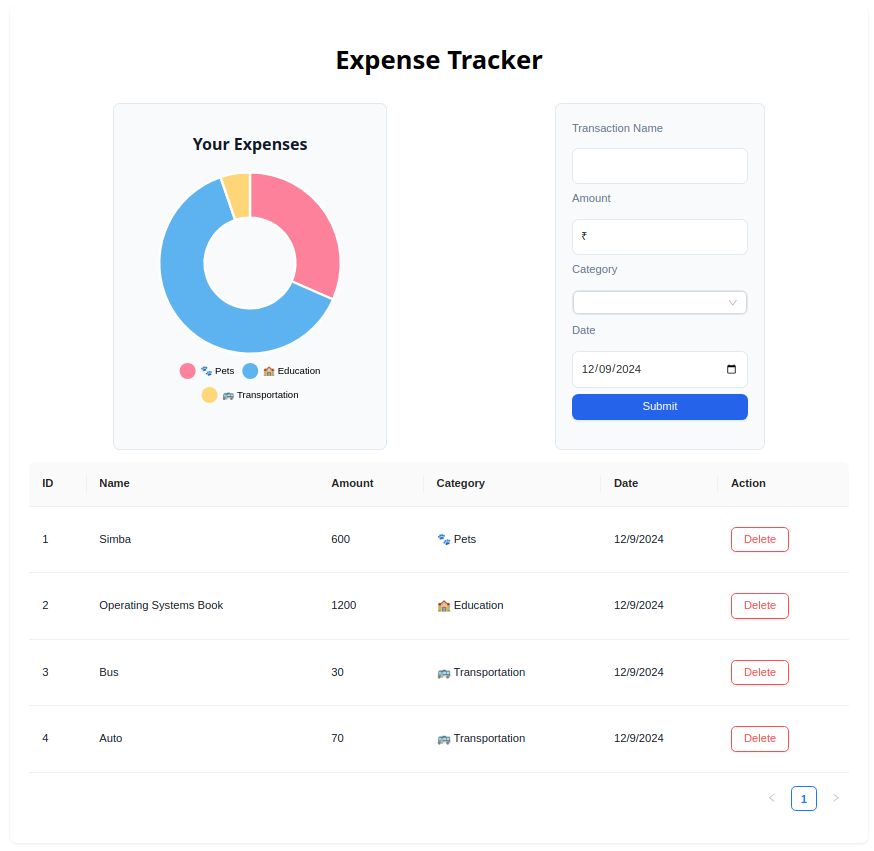

# Expense Tracker App

A simple and interactive expense tracker application built with **React (Vite + JavaScript)**, allowing you to add and delete expenses while visualizing your spending patterns.  

## Features
- Add and delete expenses effortlessly.
- View a dashboard summarizing your expenses.
- Data persistence using **localStorage**.
- Interactive UI components powered by **Ant Design**.
- Expense visualizations using **Chart.js**.

## Components
1. **Title**: Displays the app's title and branding.
2. **Dashboard**: Provides an overview of expenses.
3. **ExpenseForm**: Form for adding new expenses.
4. **ExpenseList**: List of all recorded expenses with delete functionality.

## Tech Stack
- **Frontend**: React (Vite + JavaScript)
- **State Management**: `useState` and `Context API`
- **Lifecycle Hooks**: `useEffect`
- **UI Library**: Ant Design
- **Charts**: Chart.js
- **Data Storage**: Local Storage

## Installation
1. Clone the repository:
   ```bash
   git clone https://github.com/Vaibhav323/Expense-Tracker.git
   ```
2. Navigate to the project directory:
   ```bash
   cd expense-tracker
   ```
3. Install dependencies:
   ```bash
   npm install
   ```
4. Start the development server:
   ```bash
   npm run dev
   ```
5. Open your browser and visit:
   ```
   http://localhost:5173
   ```

## Usage
1. Add an expense by filling out the form and submitting.
2. View the expense in the list.
3. Delete an expense by clicking the delete button.
4. Check the dashboard for summarized data and charts.

## Project Structure
```plaintext
src/
├── components/
│   ├── Title.jsx
│   ├── Dashboard.jsx
│   ├── ExpenseForm.jsx
│   └── ExpenseList.jsx
├── contexts/
│   └── ExpenseContext.jsx
│   └── useLocalStorageState.jsx
├── App.jsx
├── index.jsx
└── styles/
    └── App.css
```

## Libraries and Tools
- [React](https://reactjs.org/)
- [Vite](https://vitejs.dev/)
- [Ant Design](https://ant.design/)
- [Chart.js](https://www.chartjs.org/)

## Screenshots





## Contributing
Feel free to fork this repository, make changes, and submit a pull request. Suggestions and improvements are welcome!


---

**Happy Tracking!** 🎉
